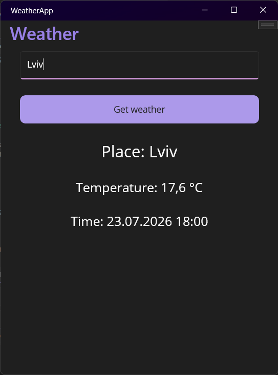

# Weather App

A simple cross-platform weather application built with **.NET MAUI** using the **MVVM** pattern.

The app allows users to search for a city by name and displays the current weather using the Open-Meteo API.

## 📸 Preview



## Features

- 🔍 Search weather by city name
- 🌡️ Display current temperature
- 🕒 Display current time
- 📍 Display selected city
- 🌐 Uses Open-Meteo Weather API
- 🏗️ Built with MVVM architecture
- 💉 Dependency Injection
- ⚡ Asynchronous API requests
- 📦 JSON deserialization with System.Text.Json

## Technologies

- .NET MAUI
- C#
- MVVM Community Toolkit
- HttpClient
- Dependency Injection
- System.Text.Json
- Open-Meteo Weather API
- Open-Meteo Geocoding API

## Project Structure

```
WeatherApp
│
├── Models
│   ├── WeatherResponse.cs
│   └── LocationResponse.cs
│
├── Services
│   ├── WeatherService.cs
│   └── LocationService.cs
│
├── ViewModels
│   └── WeatherViewModel.cs
│
├── Views
│
├── MainPage.xaml
├── App.xaml
└── MauiProgram.cs
```

## Getting Started

1. Clone the repository

```
git clone https://github.com/your_username/WeatherApp.git
```

2. Open the solution in Visual Studio 2022.

3. Build and run the project.

No API key is required because the application uses the free Open-Meteo API.

## APIs

- Weather API
  - https://open-meteo.com/
- Geocoding API
  - https://open-meteo.com/en/docs/geocoding-api

## What I Learned

While building this project I practiced:

- MVVM architecture
- Dependency Injection
- REST API integration
- Async/Await
- JSON serialization/deserialization
- Data Binding
- Working with HttpClient
- Debugging and fixing API issues

## License

This project is for learning purposes.
